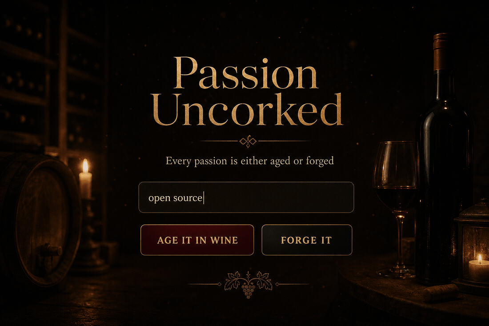
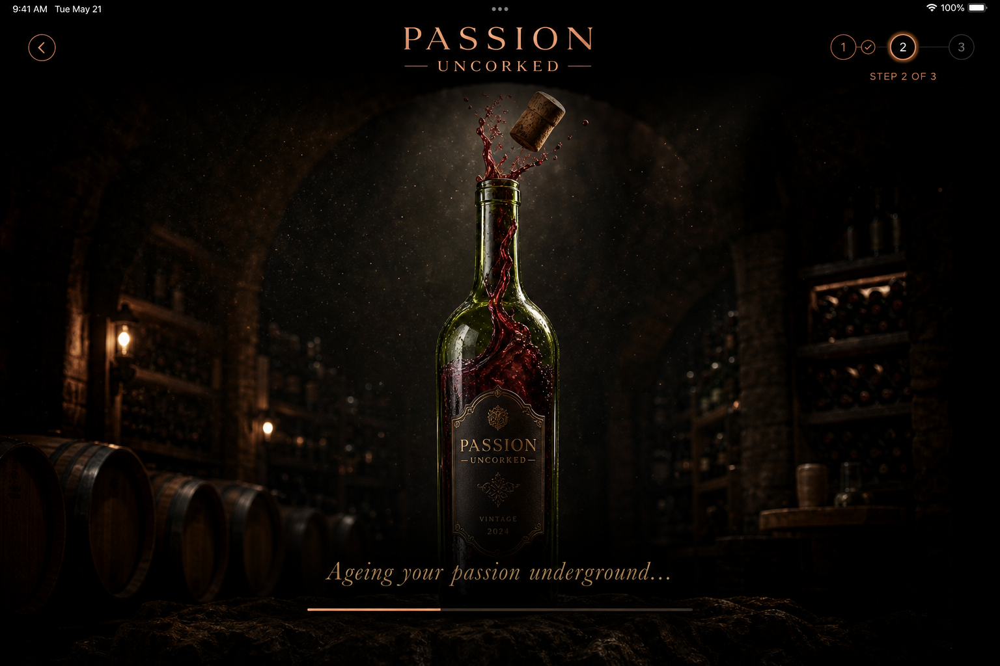
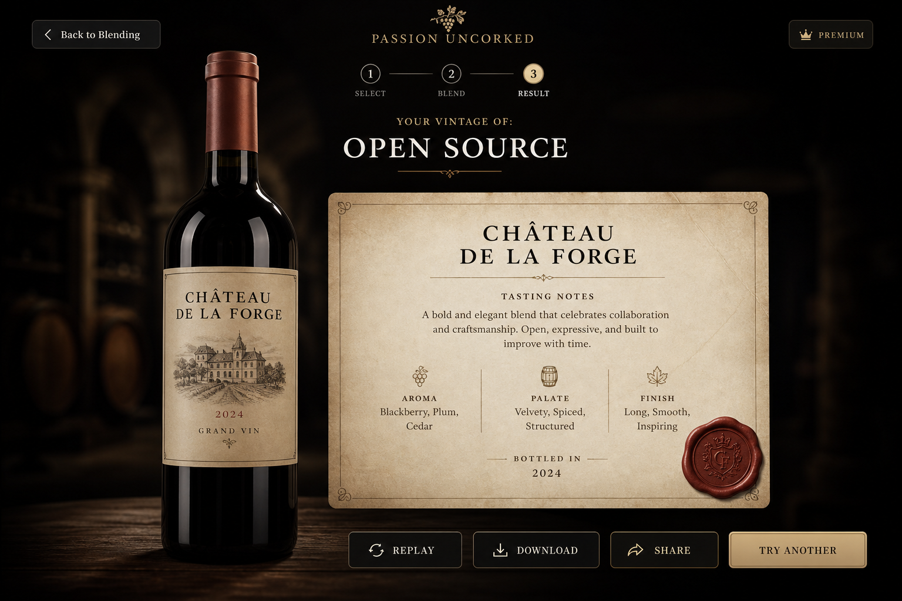

# 🍷🔥 Passion Uncorked

<p align="center">
  
  
  
  
  
  
</p>

<p align="center">
  <a href="passion-uncorked.khushalsarode-in.workers.dev">
    
  </a>
</p>

<p align="center">
  <strong>Type any passion → age it in wine or forge it in fire → a one-of-a-kind, narrated artifact in under 30 seconds.</strong><br />
  <a href="https://passion-uncorked.pages.dev"><strong>Live demo →</strong></a> · Gemini-written copy · ElevenLabs narration · original browser-synthesized score
</p>

---

## Why we built this

The **DEV Weekend Challenge: Passion Edition** asked for something inspired by passion — the fire that drives obsession, devotion, and craft, in whatever form that takes.

Everyone's passion looks different, but almost nobody gets to see theirs *presented* as something precious. A sommelier ages a grape harvest into a vintage worth collecting. A blacksmith tempers raw ore into a blade worth naming. We asked: what if we did that to *your* passion instead — whether it's "open source," "football," or "cooking for people I love"?

**Passion Uncorked** takes a single word or a full sentence and, in real time, turns it into one of two completely different artifacts:

- 🍷 **Aged in wine** — a château, a vintage year, tasting notes, a collector's note, read aloud by a warm, measured narrator.
- 🔥 **Forged in fire** — a forge name, a smith's title, temper notes, a smith's mark, read aloud by a deep, intense narrator.

Same input, two entirely different pieces of writing, art direction, and voice — because passion isn't one-size-fits-all, and neither is how you'd want it remembered.

---

## Screenshots

<p align="center">
  
  &nbsp;&nbsp;
  
  &nbsp;&nbsp;
  
</p>

| | | |
|:---:|:---:|:---:|
| **Landing** | **Loading** | **Result** |
| Dual 3D showcase + vessel picker | Full-page mood + progress | Certificate-style label between bottle & anvil |

---

## What you get

- **Wine or fire** — the same passion, run through two entirely different creative directions
- **AI-written copy** — Gemini generates the château / forge details as structured JSON, in either a warm "classy" tone or a witty "sassy roast" tone
- **Narration, per vessel** — ElevenLabs reads the result aloud with a distinct voice and delivery for wine vs. fire
- **A certificate-grade label** — an HTML/CSS artifact card with gradient borders, wax/ember seals, and responsive type that never overflows, however long the AI's writing runs
- **A visual that reacts to *your* output** — the bottle's liquid color and the forge's flame height/brightness are driven by the actual generated mood and intensity, not a static image
- **An original ambient score** — a Web Audio API composition (no audio files), distinct per vessel
- **Download & share** — high-resolution PNG export (html2canvas) + a one-click X/Twitter share link
- **A local gallery** — every generation is saved in the browser and revisiting one costs zero API calls
- **A real settings panel** — tone, motion intensity, narration volume/voice, accent color override, and an opt-in AI-art toggle

---

## How we built it

**Stack:** React 18 + Vite 5, no backend — Gemini for copy, ElevenLabs for voice, Web Audio API for music, html2canvas for export, `localStorage` for persistence. Deployed on Cloudflare Pages.

A few decisions worth calling out, since "how" mattered as much as "what" here:

- **Structured generation, not free text.** Gemini is called with `responseMimeType: 'application/json'` against a strict per-vessel schema, so every result reliably has a title, notes, a rarity/intensity line, and a `tts_script` written specifically for spoken delivery — not just the visual copy read verbatim.
- **A thinking-model quirk we had to catch.** Gemini's flash models spend an invisible "thinking" budget by default; without explicitly setting `thinkingConfig: { thinkingBudget: 0 }`, the API can return an empty response even on success. We also added a JSON-repair-and-retry pass for the rare truncated response, verified across dozens of live generations.
- **ElevenLabs via the official SDK, lazy-loaded.** The full `@elevenlabs/elevenlabs-js` SDK bundles realtime, speech-to-text, and an agents client — about 4.6MB before the app ever needs it. We dynamically `import()` it only once a user actually submits a passion, keeping the initial bundle lean.
- **Two distinct narrator voices, chosen deliberately.** Wine and fire each get their own ElevenLabs voice and `voiceSettings` (stability/style), so the narration itself carries the same wine-vs-fire personality split as the writing.
- **The vessel visual reacts to the actual output**, not a stock image. The wine bottle's liquid is tinted by the AI's own `color_mood`; the forge's flame height and brightness are derived from the AI's own `intensity` copy (a "White-Hot" result visibly burns hotter than a "Smoldering" one) — built entirely in SVG/CSS, so it's instant and free rather than gated behind paid image generation.
- **An original score, not a sample.** The ambient music is composed and synthesized live with the Web Audio API (oscillators, gain envelopes, filtered loops) — a distinct arpeggio for wine, a distinct ostinato for fire.
- **A certificate that never breaks.** The label was rebuilt from SVG to HTML/CSS specifically so long AI-generated titles wrap instead of overflowing the card, using CSS container queries so type scales to the card's own width rather than the viewport.

### Prize category alignment

This submission leans on two of the challenge's prize technologies as core, load-bearing parts of the experience rather than bolted-on extras:

- 🟦 **Best use of Google AI** — Gemini isn't just a copy generator here; it drives structured JSON output, tone switching (classy/sassy), the mood system that colors the entire UI, and the narration script itself.
- ⚫ **Best use of ElevenLabs** — every generation is narrated with vessel-specific voices and voice settings via the official ElevenLabs SDK, making narration a first-class output alongside the visual label, not an afterthought.

---

## Run locally

```bash
git clone https://github.com/Khushalsarode/dev.to-challenge.git
cd dev.to-challenge
npm install
cp .env.example .env   # add VITE_GEMINI_KEY + VITE_ELEVENLABS_KEY
npm run dev
```

| Key | Get it |
|---|---|
| `VITE_GEMINI_KEY` | [Google AI Studio](https://aistudio.google.com) |
| `VITE_ELEVENLABS_KEY` | [ElevenLabs](https://elevenlabs.io) → Profile → API Keys |

<details>
<summary><strong>More details (if you actually read READMEs)</strong></summary>

### Stack
React 18 · Vite · Gemini · ElevenLabs · Web Audio API · html2canvas · localStorage

### Deploy
Push to GitHub → [Cloudflare Pages](https://pages.cloudflare.com) → create a project from the repo → build command `npm run build`, output directory `dist` → add the two env vars → deploy.

### Notes
- AI artwork (photorealistic bottle/forge photos) needs a **paid** Gemini key — the free tier has zero image quota. The illustrated bottle/flame visual works fully on the free tier and is the default.
- ElevenLabs keys can have their own usage cap independent of plan credits.

</details>

---

## Team

Built by a team of two for the **DEV Weekend Challenge: Passion Edition**:

- [@khushalsarode](https://dev.to/khushalsarode)
- [@rajatsavdekar](https://dev.to/rajatsavdekar)

---

Built for **DEV Weekend Challenge: Passion Edition**.
